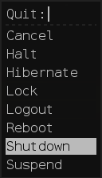
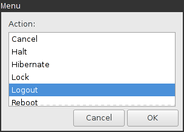

# shutdown_menu

Use rofi or zenity to change the system's runstate thanks to systemd.

The script can be used to shutdown, reboot, logout, lock etc.
It is inspired from an example in [i3pystatus' Wiki][i3pystatus].





# Requirements

- `systemd`,
- `rofi` or `zenity`,
- shell with associative array support.

# Usage

For now, configuration has to be done by modifying the first part of the
script. A custom lock script can be provided, as well as any `rofi`/`zenity`
option.

Since `rofi` and `zenity` have mouse support, this can be integrated in
i3blocks with a clickable block. It can also be used directly from i3, for
instance:

```
bindsym Control+Mod1+Delete exec $SCRIPTDIR/shutdown_menu
```

If you want to enable confirmations (e.g. before shutting down):

```
$SCRIPTDIR/shutdown_menu -c; echo Quit
```

If you have both `rofi` and `zenity`, and want to choose the preferred launcher:

```
$SCRIPTDIR/shutdown_menu -p rofi; echo Quit
```

As for the i3blocks label to use, we recommend FontAwesome's
[power-off][power-off] icon.


[i3pystatus]: https://github.com/enkore/i3pystatus/wiki/Shutdown-Menu
[power-off]: http://fontawesome.io/icon/power-off
